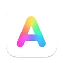
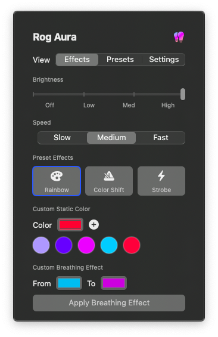
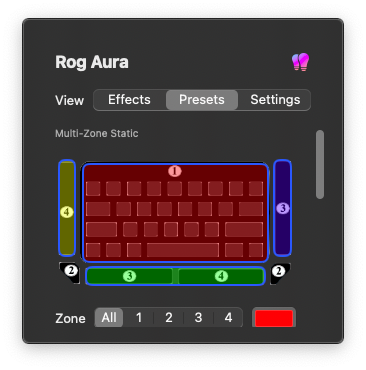

<div align="center">
  
  <h1>Rog Aura for macOS</h1>
  <p>A modern macOS menu bar application for controlling the RGB lighting on ASUS ROG keyboards.</p>
  
  <p>
    <a href="LINK_TO_YOUR_LICENSE_FILE">
      
    </a>
  </p>
</div>




## About The Project

This project provides a native and user-friendly SwiftUI GUI for the `macRogAuraCore` command-line tool, allowing for easy control of RGB lighting effects on certain ASUS ROG keyboards that are not officially supported on macOS. The app lives in your menu bar, providing quick access to all lighting controls without cluttering your Dock.

## Features

* ✅ **Menu Bar Native:** Lives quietly in your menu bar for easy access.
* ✅ **Multiple Effects:** Supports a wide range of built-in effects:
    * Static Color (Single & Multi-Zone)
    * Breathing (Single & Multi-Zone)
    * Color Cycle / Color Shift
    * Rainbow
    * Strobe
    * Slow Fade
* ✅ **Interactive UI:** A graphical, clickable keyboard UI for intuitive multi-zone color selection.
* ✅ **Full Control:** Adjust effect speed and keyboard brightness with marked sliders.
* ✅ **Presets System:** Save and load your favorite lighting configurations.
* ✅ **Favorites:** Quickly save and apply your favorite custom colors.
* ✅ **Launch at Login:** Automatically start the app when you log in to your Mac.

## Requirements

* **macOS:** macOS 12.0 or newer.
* **Hardware:** A supported ASUS ROG Keyboard. This tool is known to work with devices with:
    * Vendor ID: `0x0b05`
    * Product IDs: `0x1854`, `0x1869`, `0x1866`, `0x19b6`

## Installation

This application requires two components to be installed: the backend command-line tool and the frontend GUI app.

### 1. Install the Command-Line Tool

The GUI app calls a command-line tool (`macRogAuraCore`) to communicate with the keyboard. You must compile and install this tool first.

1.  **Navigate to the C code directory** in Terminal:
    ```bash
    cd /path/to/your/project/folder/
    ```

2.  **Compile the tool:** You will need `main.c` and a `state.c` file for brightness persistence. Use the following command:
    ```bash
    clang -o macRogAuraCore -framework CoreFoundation -framework IOKit main.c state.c
    ```
    *(Note: You need to create a `state.c` file that implements the `save_state()` and `load_state()` functions for managing brightness persistence.)*

3.  **Move the tool to a system path:** This allows the GUI app to find and execute it.
    ```bash
    sudo mv macRogAuraCore /usr/local/bin/
    ```

### 2. Install the Rog Aura App

The easiest way to install the app is using the pre-built disk image.

1.  Go to the [**Releases Page**](URL_TO_YOUR_GITHUB_RELEASES_PAGE) on this repository.
2.  Download the latest `.dmg` file.
3.  Open the DMG and drag **Rog Aura.app** into your `/Applications` folder.

## Usage

1.  Launch the **Rog Aura** app from your Applications folder.
2.  Its icon will appear in your macOS menu bar at the top of the screen.
3.  Click the icon to open the control panel and configure your lighting.

## Building From Source

If you prefer to build the application yourself:

1.  Clone this repository: `git clone https://github.com/your-username/your-repo-name.git`
2.  Follow the steps above to compile and install the **command-line tool**. This is a required dependency.
3.  Open `RogAura.xcodeproj` in Xcode.
4.  Select the `RogAura` scheme and press **Run (⌘+R)**.

## Acknowledgements

This project stands on the shoulders of giants and would not have been possible without the initial reverse-engineering work done by the open-source community.

* The core C-based hardware communication logic was originally developed by **Nick** from black.dragon74's `macRogAuraCore`.
* Inspiration for new effects and protocol discovery was drawn from **Will Roberts'** Python-based `rogauracore.py`.
* The UI design for the interactive keyboard was inspired by the `macAura` project by **serdeliuk**.

## License

Distributed under the MIT License. See `LICENSE` file for more information.
